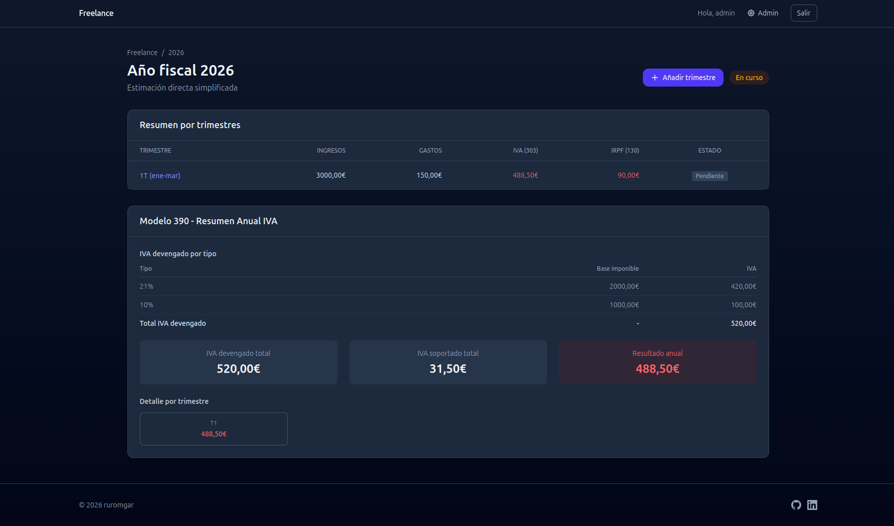

# Freelance

Gestión fiscal para autónomos: control de ingresos, gastos y cálculo de modelos trimestrales (303, 130) y anuales (390).

## Capturas




## Instalación

1. Instala [Docker Desktop](https://www.docker.com/products/docker-desktop/)
2. Clona o descarga el repositorio a alguna carpeta, digamos `proyecto_descargado`
3. Abre una terminal y ejecuta:

```bash
cd proyecto_descargado
cp .env.example .env
docker compose up
```

4. Abre `http://localhost:8000` en tu navegador

Tus datos se guardan en `.data/` y persisten entre ejecuciones. Para parar la aplicación, pulsa `Ctrl+C` en la terminal.

### Superusuario por defecto

En el primer arranque se crea automáticamente un superusuario:

- **Usuario**: `admin`
- **Contraseña**: `supersecret`

Cambia la contraseña tras el primer inicio de sesión desde el panel de admin en `/room/`.

## Setup de desarrollo

```bash
uv sync
cp .env.example .env   # rellenar con tus datos
make migrate
make run
```

## Stack

- **Backend**: Django 5.x
- **Frontend**: Tailwind CSS (CDN), HTMX
- **Admin**: Django Admin con tema Unfold (`/room/`)
- **Base de datos**: SQLite
- **Gestor de paquetes**: uv
